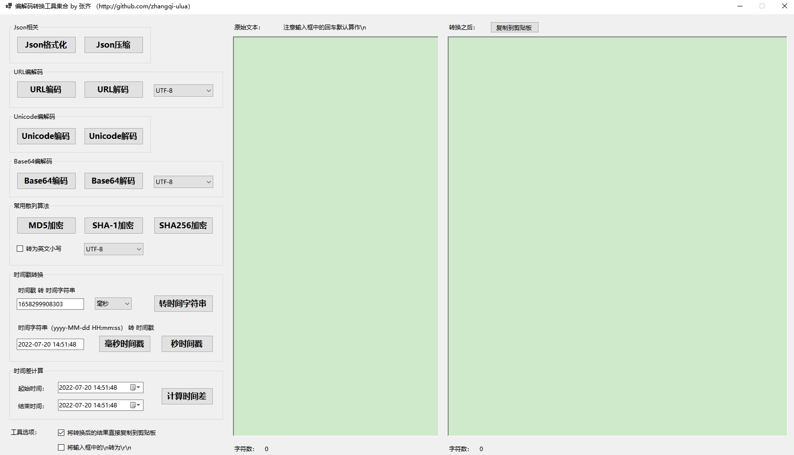

# ConvertTools
编码转换工具集合，含Json、URL编解码、Unicode编解码、Base64编解码、常用散列算法（MD5、SHA-1）、时间戳转换、时间差计算

## 写在前面

这应该是迄今为止，我开源的最没什么技术含量的一个工具了（偷笑），花了不到两小时捣鼓出来的。之前是浏览器收藏夹中收藏了一堆各家的工具类网站，想用什么打开什么。你可能会问，不是很多网站有工具合集么？没错，但各家都有各自的问题，比如URL编解码只支持UTF-8，输入框中的回车都按\r\n处理，不符合Linux或编程中用\n换行……所以我之前偷懒的办法就是挑选各家某个做得完善的功能网页进行收藏，虽然收藏夹七八个网页，也就凑活着用了，有些网站为了它几行可怜巴巴毫无技术含量的js代码不被其他网站拿去，做成由它们服务器计算结果然后返回，这样一来还要限制输入内容的字节数，稍微长一点的内容，还得自己手工分拆成多个，转换多次再手工合并，还是因为太懒，以前也忍了。直到断网几小时，工作没法做了，才下定决定，花点时间做个一劳永逸的离线工具，于是有了它

## 软件截图

## 开发及运行说明

本工具使用C#编程语言，基于.NET 6.0开发 
运行本工具需要在Windows系统中安装.NET 6.0的运行环境，微软官网下载地址为：https://dotnet.microsoft.com/zh-cn/download/dotnet/6.0 ，打开网页后选择下载“.NET 桌面运行时” 
安装完运行环境后，双击打开“ConvertTools.exe”，即可运行本工具

## 反馈交流

QQ群：132108644
